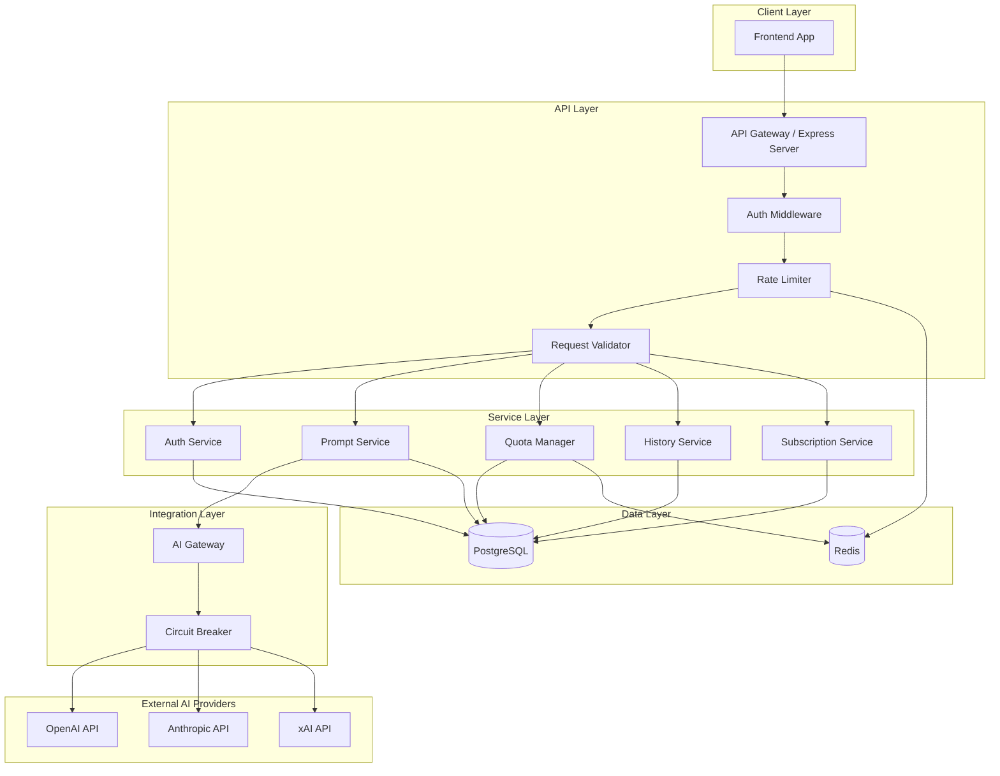
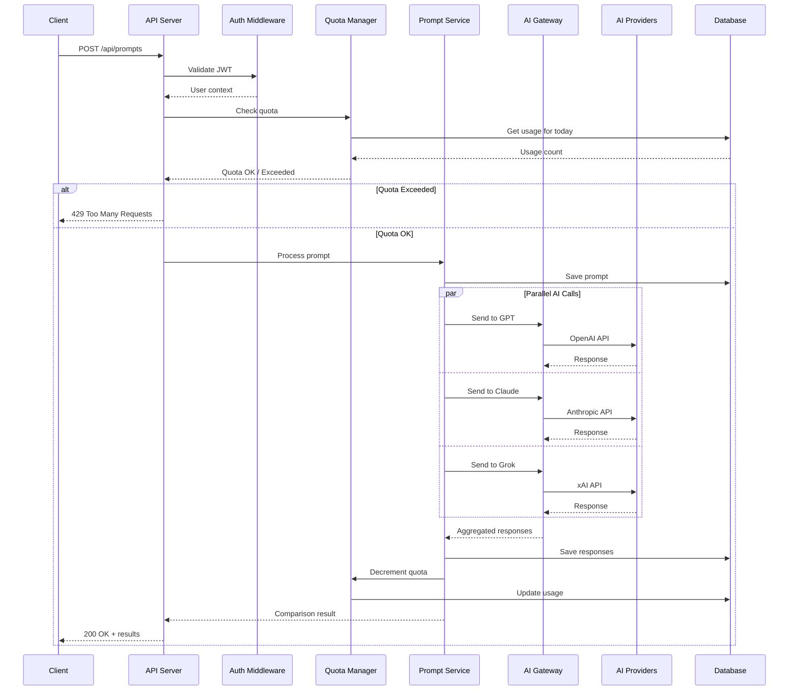

# Design Document: Backend API

## Overview

The AI Comparator Hub backend is a RESTful API service that enables users to submit prompts to multiple AI models (GPT-4, Claude 3, Grok) simultaneously and receive structured comparison results. The system handles authentication, subscription management, usage tracking, and comparison history.

The architecture follows a layered design with clear separation between HTTP handling, business logic, and external service integration. It prioritizes parallel execution for AI model calls, resilient error handling, and secure credential management.

## Architecture



## Components and Interfaces

### API Routes

```typescript
// Authentication Routes
POST   /api/auth/signup          // Create new user account
POST   /api/auth/login           // Authenticate user
POST   /api/auth/refresh         // Refresh access token
POST   /api/auth/logout          // Invalidate refresh token

// Prompt Routes
POST   /api/prompts              // Submit prompt for comparison
GET    /api/prompts/:id          // Get specific comparison result

// History Routes
GET    /api/history              // Get user's comparison history
GET    /api/history/:id          // Get specific historical comparison

// Usage & Subscription Routes
GET    /api/usage                // Get current usage stats
GET    /api/subscription         // Get subscription details
POST   /api/subscription/upgrade // Upgrade subscription tier

// Admin Routes (optional)
POST   /api/admin/kill-switch    // Enable/disable prompt submissions
POST   /api/admin/reset-quota    // Reset user's quota
GET    /api/admin/metrics        // Get system metrics
```

### Service Interfaces

```typescript
interface AuthService {
  signup(email: string, password: string): Promise<AuthResult>;
  login(email: string, password: string): Promise<AuthResult>;
  refreshToken(refreshToken: string): Promise<AuthResult>;
  validateToken(accessToken: string): Promise<User>;
  logout(userId: string, refreshToken: string): Promise<void>;
}

interface PromptService {
  submitPrompt(request: PromptRequest): Promise<ComparisonResult>;
  getComparison(id: string, userId: string): Promise<ComparisonResult>;
}

interface QuotaManager {
  checkQuota(userId: string): Promise<QuotaStatus>;
  decrementQuota(userId: string): Promise<void>;
  resetQuota(userId: string): Promise<void>;
  getUsageStats(userId: string): Promise<UsageStats>;
}

interface HistoryService {
  getHistory(userId: string, options: PaginationOptions): Promise<HistoryPage>;
  getComparison(id: string, userId: string): Promise<ComparisonResult>;
}

interface AIGateway {
  sendPrompt(model: AIModel, prompt: string, contentType: ContentType): Promise<ModelResponse>;
  sendPromptToMultiple(models: AIModel[], prompt: string, contentType: ContentType): Promise<ModelResponse[]>;
}
```

## Data Models

```typescript
// User Model
interface User {
  id: string;                    // UUID
  email: string;                 // Unique, indexed
  passwordHash: string;          // bcrypt hash
  subscriptionTier: SubscriptionTier;
  createdAt: Date;
  updatedAt: Date;
}

// Subscription Tiers
type SubscriptionTier = 'free' | 'pro' | 'team';

interface SubscriptionPlan {
  tier: SubscriptionTier;
  dailyLimit: number | null;     // null = unlimited
  maxModelsPerComparison: number;
  historyRetentionDays: number | null; // null = unlimited
  maxTeamMembers: number;
}

// Prompt and Response Models
interface Prompt {
  id: string;                    // UUID
  userId: string;                // Foreign key to User
  content: string;               // The prompt text
  contentType: ContentType;
  createdAt: Date;
}

type ContentType = 'code' | 'text' | 'speech' | 'summary' | 'email' | 'other';

interface ModelResponse {
  id: string;                    // UUID
  promptId: string;              // Foreign key to Prompt
  model: AIModel;
  content: string;               // AI response text
  responseTimeMs: number;        // Response time in milliseconds
  status: ResponseStatus;
  errorMessage?: string;
  createdAt: Date;
}

type AIModel = 'gpt' | 'claude' | 'grok';
type ResponseStatus = 'success' | 'error' | 'timeout';

// Comparison Result (aggregated view)
interface ComparisonResult {
  id: string;
  prompt: {
    content: string;
    contentType: ContentType;
  };
  responses: {
    model: AIModel;
    content: string;
    responseTimeMs: number;
    status: ResponseStatus;
    errorMessage?: string;
  }[];
  createdAt: Date;
}

// Usage Tracking
interface UsageLog {
  id: string;
  userId: string;
  date: string;                  // YYYY-MM-DD format
  comparisonsUsed: number;
  updatedAt: Date;
}

interface UsageStats {
  used: number;
  limit: number | null;
  remaining: number | null;
  resetAt: Date;
}

// Authentication
interface AuthResult {
  accessToken: string;
  refreshToken: string;
  expiresIn: number;
  user: {
    id: string;
    email: string;
    subscriptionTier: SubscriptionTier;
  };
  usage: UsageStats;
}

interface RefreshToken {
  id: string;
  userId: string;
  token: string;                 // Hashed token
  expiresAt: Date;
  createdAt: Date;
}
```

### Database Schema (PostgreSQL)

```sql
-- Users table
CREATE TABLE users (
  id UUID PRIMARY KEY DEFAULT gen_random_uuid(),
  email VARCHAR(255) UNIQUE NOT NULL,
  password_hash VARCHAR(255) NOT NULL,
  subscription_tier VARCHAR(20) DEFAULT 'free',
  created_at TIMESTAMP DEFAULT NOW(),
  updated_at TIMESTAMP DEFAULT NOW()
);

-- Refresh tokens table
CREATE TABLE refresh_tokens (
  id UUID PRIMARY KEY DEFAULT gen_random_uuid(),
  user_id UUID REFERENCES users(id) ON DELETE CASCADE,
  token_hash VARCHAR(255) NOT NULL,
  expires_at TIMESTAMP NOT NULL,
  created_at TIMESTAMP DEFAULT NOW()
);

-- Prompts table
CREATE TABLE prompts (
  id UUID PRIMARY KEY DEFAULT gen_random_uuid(),
  user_id UUID REFERENCES users(id) ON DELETE CASCADE,
  content TEXT NOT NULL,
  content_type VARCHAR(20) NOT NULL,
  created_at TIMESTAMP DEFAULT NOW()
);

-- Model responses table
CREATE TABLE model_responses (
  id UUID PRIMARY KEY DEFAULT gen_random_uuid(),
  prompt_id UUID REFERENCES prompts(id) ON DELETE CASCADE,
  model VARCHAR(20) NOT NULL,
  content TEXT,
  response_time_ms INTEGER NOT NULL,
  status VARCHAR(20) NOT NULL,
  error_message TEXT,
  created_at TIMESTAMP DEFAULT NOW()
);

-- Usage logs table
CREATE TABLE usage_logs (
  id UUID PRIMARY KEY DEFAULT gen_random_uuid(),
  user_id UUID REFERENCES users(id) ON DELETE CASCADE,
  date DATE NOT NULL,
  comparisons_used INTEGER DEFAULT 0,
  updated_at TIMESTAMP DEFAULT NOW(),
  UNIQUE(user_id, date)
);

-- Indexes
CREATE INDEX idx_prompts_user_id ON prompts(user_id);
CREATE INDEX idx_prompts_created_at ON prompts(created_at DESC);
CREATE INDEX idx_model_responses_prompt_id ON model_responses(prompt_id);
CREATE INDEX idx_usage_logs_user_date ON usage_logs(user_id, date);
CREATE INDEX idx_refresh_tokens_user_id ON refresh_tokens(user_id);
```

## Execution Flow

### Prompt Submission Flow




## Error Handling

### Error Response Format

```typescript
interface ErrorResponse {
  status: number;
  error: {
    type: string;
    message: string;
    details?: Record<string, unknown>;
  };
}

// Example error types
const ERROR_TYPES = {
  VALIDATION_ERROR: 'VALIDATION_ERROR',
  AUTHENTICATION_ERROR: 'AUTHENTICATION_ERROR',
  AUTHORIZATION_ERROR: 'AUTHORIZATION_ERROR',
  QUOTA_EXCEEDED: 'QUOTA_EXCEEDED',
  RATE_LIMITED: 'RATE_LIMITED',
  AI_SERVICE_ERROR: 'AI_SERVICE_ERROR',
  NOT_FOUND: 'NOT_FOUND',
  INTERNAL_ERROR: 'INTERNAL_ERROR',
};
```

### Circuit Breaker Configuration

```typescript
interface CircuitBreakerConfig {
  failureThreshold: 5;           // Open circuit after 5 failures
  successThreshold: 2;           // Close circuit after 2 successes
  timeout: 30000;                // 30 second timeout
  resetTimeout: 60000;           // Try again after 60 seconds
}
```

### Retry Strategy

```typescript
interface RetryConfig {
  maxRetries: 2;
  baseDelayMs: 1000;
  maxDelayMs: 5000;
  backoffMultiplier: 2;          // Exponential backoff
}
```

## Security Considerations

### Authentication Flow

1. **Signup**: Hash password with bcrypt (cost 10), create user, generate tokens
2. **Login**: Verify password hash, generate new token pair
3. **Token Refresh**: Validate refresh token, issue new access token
4. **Logout**: Invalidate refresh token in database

### JWT Token Structure

```typescript
// Access Token Payload (15 min expiry)
interface AccessTokenPayload {
  sub: string;                   // User ID
  email: string;
  tier: SubscriptionTier;
  iat: number;
  exp: number;
}

// Refresh Token (7 day expiry)
// Stored hashed in database, raw token sent to client
```

### API Key Management

- Store AI provider keys in environment variables
- Never log or expose API keys
- Use separate keys for development/production
- Rotate keys periodically

### Input Validation

```typescript
// Prompt validation schema (using Zod)
const promptSchema = z.object({
  content: z.string().min(1).max(10000),
  contentType: z.enum(['code', 'text', 'speech', 'summary', 'email', 'other']),
  models: z.array(z.enum(['gpt', 'claude', 'grok'])).min(1).max(3),
});

// Registration validation
const signupSchema = z.object({
  email: z.string().email(),
  password: z.string()
    .min(8)
    .regex(/[0-9]/, 'Must contain a number')
    .regex(/[A-Z]/, 'Must contain uppercase letter'),
});
```

## Rate Limiting Strategy

```typescript
// Redis-based rate limiting
interface RateLimitConfig {
  windowMs: 60000;               // 1 minute window
  maxRequests: 60;               // 60 requests per window
  keyPrefix: 'ratelimit:';
}

// Rate limit response headers
// X-RateLimit-Limit: 60
// X-RateLimit-Remaining: 45
// X-RateLimit-Reset: 1703894400
// Retry-After: 30 (when limited)
```


## Correctness Properties

*A property is a characteristic or behavior that should hold true across all valid executions of a system—essentially, a formal statement about what the system should do. Properties serve as the bridge between human-readable specifications and machine-verifiable correctness guarantees.*

### Property 1: Authentication Round-Trip

*For any* valid email and password combination, registering a user then logging in with those credentials should return valid JWT tokens that can be used to access protected endpoints.

**Validates: Requirements 1.1, 1.5, 2.1**

### Property 2: Password Validation Rejects Weak Passwords

*For any* password that does not contain at least 8 characters, one number, and one uppercase letter, registration should fail with a 400 Bad Request error.

**Validates: Requirements 1.3**

### Property 3: New Users Default to Free Tier

*For any* newly registered user, their subscription tier should be 'free' and their daily quota should be 10 comparisons.

**Validates: Requirements 1.4**

### Property 4: Invalid Credentials Return 401

*For any* login attempt with an incorrect password or non-existent email, the Auth_Service should return a 401 Unauthorized error.

**Validates: Requirements 2.2**

### Property 5: Token Refresh Validity

*For any* valid refresh token, requesting a new access token should succeed and return a valid access token. *For any* invalid or expired refresh token, the request should fail with 401.

**Validates: Requirements 2.3, 2.4**

### Property 6: Valid Prompt Processing

*For any* authenticated user with available quota, submitting a prompt with 1-3 valid models and content between 1-10,000 characters should be accepted and processed.

**Validates: Requirements 3.1, 3.3**

### Property 7: Invalid Prompt Rejection

*For any* prompt submission with 0 models, more than 3 models, empty content, or content exceeding 10,000 characters, the request should be rejected with a 400 Bad Request error.

**Validates: Requirements 3.2, 3.6**

### Property 8: Quota Enforcement

*For any* user who has exhausted their daily quota, subsequent prompt submissions should be rejected with a 429 Too Many Requests error.

**Validates: Requirements 3.5, 5.3**

### Property 9: Response Structure Completeness

*For any* successful comparison, the response should contain: prompt content, content type, and for each model: output content, response time in milliseconds, and status.

**Validates: Requirements 4.1, 4.5**

### Property 10: Partial Failure Isolation

*For any* comparison where one AI model fails (timeout or error), the responses from other successful models should still be returned with their complete data.

**Validates: Requirements 4.2, 4.3**

### Property 11: Comparison Persistence Round-Trip

*For any* completed comparison, the prompt and all responses should be persisted to the database and retrievable via the history endpoint with identical data.

**Validates: Requirements 4.4, 7.5**

### Property 12: Quota Decrement Consistency

*For any* successful comparison, the user's remaining quota should decrease by exactly 1, and this should be reflected in the usage log.

**Validates: Requirements 5.1, 5.6**

### Property 13: Usage Stats Completeness

*For any* usage status request, the response should contain: used count, limit (or null for unlimited), remaining (or null), and reset timestamp.

**Validates: Requirements 5.2**

### Property 14: Subscription Tier Limits

*For any* user on the Free tier, they should be limited to 2 models per comparison and 10 comparisons per day. *For any* user on Pro or Team tier, they should be allowed 3 models and unlimited comparisons.

**Validates: Requirements 5.3, 5.4, 6.2**

### Property 15: History Pagination

*For any* history request, the response should return at most 50 items and include pagination metadata (total count, page, hasMore).

**Validates: Requirements 7.1**

### Property 16: History Tier-Based Retention

*For any* Free tier user, history should only include comparisons from the last 7 days. *For any* Pro or Team user, all historical comparisons should be accessible.

**Validates: Requirements 7.2, 7.3**

### Property 17: History Item Completeness

*For any* history item, it should include: prompt content, content type, selected models, all responses with their data, and timestamps.

**Validates: Requirements 7.4**

### Property 18: Rate Limiting Enforcement

*For any* user making more than 60 requests within a 1-minute window, subsequent requests should be rejected with 429 and include a Retry-After header.

**Validates: Requirements 8.1, 8.2**

### Property 19: Protected Endpoint Authentication

*For any* request to a protected endpoint without a valid JWT token, the server should return a 401 Unauthorized error.

**Validates: Requirements 8.6**

### Property 20: Password Hashing Security

*For any* stored user password, it should be hashed using bcrypt with a cost factor of at least 10, and the original password should not be recoverable.

**Validates: Requirements 8.5**

### Property 21: Error Response Format Consistency

*For any* error response from the API, it should follow the format: { status, error: { type, message } } with appropriate HTTP status code.

**Validates: Requirements 9.3, 9.4**

### Property 22: Retry Behavior on AI Failure

*For any* AI service call that fails, the system should retry up to 2 times with exponential backoff before returning an error status.

**Validates: Requirements 9.1, 9.2**

### Property 23: Circuit Breaker Activation

*For any* AI service that fails 5 consecutive times, the circuit breaker should open and subsequent requests should fail fast without calling the service.

**Validates: Requirements 9.5**

## Testing Strategy

### Testing Framework

- **Runtime**: Node.js with TypeScript
- **Test Runner**: Vitest
- **Property-Based Testing**: fast-check
- **HTTP Testing**: supertest
- **Database**: PostgreSQL with test database
- **Mocking**: vitest mocks for external AI services

### Dual Testing Approach

**Unit Tests** will cover:
- Individual service methods
- Validation logic edge cases
- Error handling paths
- Specific examples demonstrating correct behavior

**Property-Based Tests** will cover:
- Universal properties that must hold for all valid inputs
- Input validation across generated test cases
- Round-trip consistency (register → login, save → retrieve)
- Quota and rate limiting behavior

### Test Configuration

```typescript
// vitest.config.ts
export default {
  test: {
    globals: true,
    environment: 'node',
    setupFiles: ['./tests/setup.ts'],
    coverage: {
      provider: 'v8',
      reporter: ['text', 'json', 'html'],
    },
  },
};

// Property test configuration
const FC_CONFIG = {
  numRuns: 100,  // Minimum 100 iterations per property
  verbose: true,
};
```

### Test Organization

```
backend/
├── tests/
│   ├── setup.ts              # Test database setup
│   ├── generators/           # fast-check generators
│   │   ├── user.gen.ts
│   │   ├── prompt.gen.ts
│   │   └── response.gen.ts
│   ├── unit/
│   │   ├── auth.test.ts
│   │   ├── prompt.test.ts
│   │   ├── quota.test.ts
│   │   └── history.test.ts
│   └── properties/
│       ├── auth.prop.ts
│       ├── prompt.prop.ts
│       ├── quota.prop.ts
│       └── history.prop.ts
```

### Property Test Annotations

Each property test must be annotated with:
- Feature name
- Property number
- Requirements reference

Example:
```typescript
// Feature: backend-api, Property 1: Authentication Round-Trip
// Validates: Requirements 1.1, 1.5, 2.1
test.prop([validEmailArb, validPasswordArb], { numRuns: 100 })(
  'registration then login returns valid tokens',
  async (email, password) => {
    // Test implementation
  }
);
```
